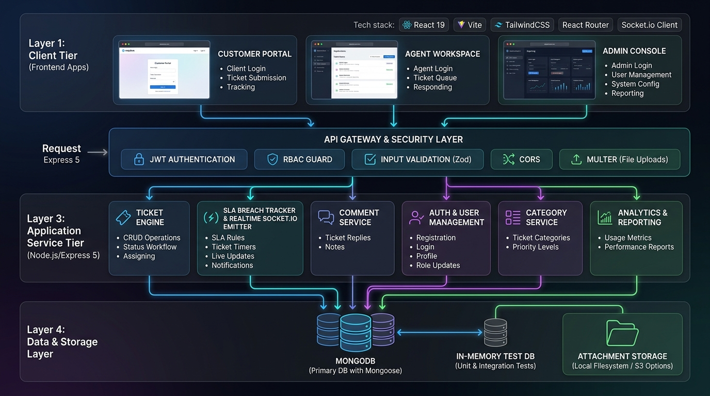
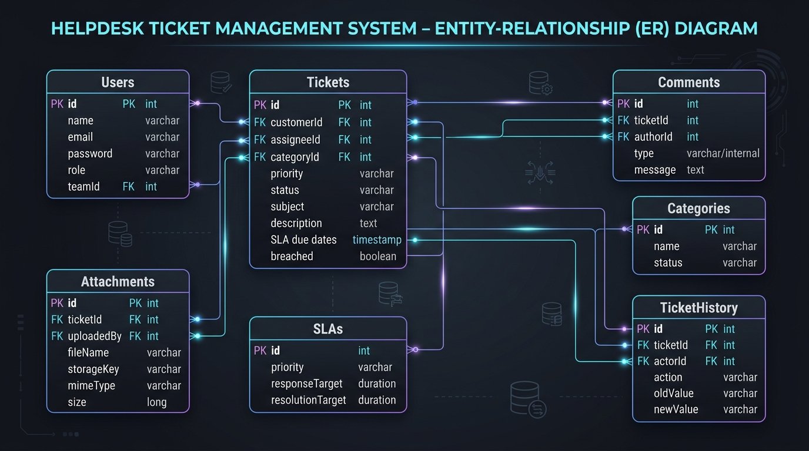
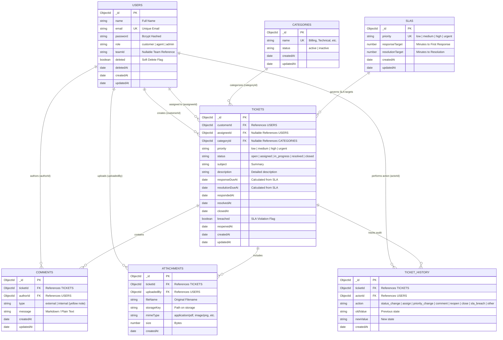

# HelpDesk Ticket Management System

A full-stack, enterprise-grade **HelpDesk Ticket Management System** featuring multi-role Role-Based Access Control (RBAC), dynamic Service Level Agreement (SLA) monitoring and breach detection, real-time messaging via WebSockets, yellow internal support notes, and reporting analytics.

---

## System Architecture



---

## Database Schema & Entity-Relationship (ER) Diagram



### Database ER Diagram (Mermaid)



---

## Role-Based Workflows

### 1. Ticket Lifecycle & Queue Visibility
- **Customer Creates Ticket**:
  - The ticket starts in `open` status with `assigneeId: null`.
  - Visible to the customer, all agents (in the **Unassigned Queue**), and admins.
- **Agent Claims Ticket ("Assign to Me")**:
  - The ticket transitions to `assigned` and `assigneeId` is set to the claiming agent.
  - The ticket moves into the claiming agent's **My Assigned** list.
  - The ticket is **automatically hidden** from other agents' queues and detail access (`403 Forbidden`).
  - Admins maintain full visibility.
- **Agent Unassigns Ticket ("Unassign Me")**:
  - `assigneeId` is reset to `null` and status returns to `open`.
  - The ticket immediately reappears in the **Unassigned Queue** for all agents to claim.
- **Admin Assignment & Reassignment**:
  - Admins can assign or reassign any ticket to any active agent at any time.
  - Upon reassignment from Agent A to Agent B, Agent A immediately loses access and Agent B gains access.

### 2. Communication & Yellow Internal Notes
- **External Messages**: Shared between customer and assigned support agents.
- **Internal Notes**:
  - Support agents and admins can post private internal notes.
  - Displayed in a **prominent yellow banner** (`bg-amber-100/90`, `border-amber-300`, `text-amber-950`) with a `🔒 Internal Note` indicator.
  - Completely stripped from all customer responses and timelines at the backend security layer.

---

## Quick Start & Local Setup

### 1. Prerequisites
- **Node.js**: v20.x or higher
- **MongoDB**: Local MongoDB server (`mongodb://localhost:27017`) or a MongoDB Atlas URI

---

### 2. Backend Setup
```bash
# Navigate to backend
cd backend

# Install dependencies
npm install

# Create environment configuration
cp .env.example .env # or configure .env manually

# Seed database with sample users, SLAs, categories, tickets, and internal notes
npm run seed:reset

# Start backend development server (Port 5000)
npm run dev
```

---

### 3. Frontend Setup
```bash
# In a new terminal window, navigate to frontend
cd frontend

# Install dependencies
npm install

# Start frontend development server (Port 5173)
npm run dev
```

Visit **`http://localhost:5173`** in your browser.

---

## Demo Accounts

| Role | Email | Password | Permissions |
| :--- | :--- | :--- | :--- |
| **Admin** | `admin@helpdesk.local` | `Admin@1234` | Full access to users, categories, SLA policies, analytics reports, and all tickets |
| **Agent 1** | `agent.alice@helpdesk.local` | `Agent@1234` | Tier 1 support: assigned/unassigned queues, ticket claiming, internal notes |
| **Agent 2** | `agent.bob@helpdesk.local` | `Agent@1234` | Tier 2 support: escalated technical tickets, claim/unassign, internal notes |
| **Customer** | `carol.customer@example.com` | `Customer@1234` | Customer portal: create tickets, view status, chat with assigned agents |
| **Customer** | `dave.customer@example.com` | `Customer@1234` | Customer portal: create tickets, upload attachments |

---

## Testing & Quality Assurance

Both frontend and backend include automated test suites with 100% passing results:

### Run Backend Tests (10 Suites, 109 Tests)
```bash
cd backend
npm run test
```

### Run Frontend Tests (17 Suites, 48 Tests)
```bash
cd frontend
npm run test
# or watch mode:
npm run test:watch
```

---

## Production Deployment Guide

### 1. Backend Production Deployment (Node.js / PM2)
```bash
cd backend
npm run build

# Start with PM2 Process Manager
pm2 start dist/server.js --name "helpdesk-api" -i max
pm2 save
pm2 startup
```

### 2. Frontend Production Deployment (Static SPA Build)
```bash
cd frontend
npm run build # Generates production bundle in dist/
```

### 3. Nginx Reverse Proxy Configuration
```nginx
server {
    listen 80;
    server_name helpdesk.yourdomain.com;

    # Frontend Single Page App
    location / {
        root /var/www/helpdesk/frontend/dist;
        index index.html;
        try_files $uri $uri/ /index.html;
    }

    # Backend REST API
    location /api/ {
        proxy_pass http://localhost:5000/api/;
        proxy_http_version 1.1;
        proxy_set_header Upgrade $http_upgrade;
        proxy_set_header Connection 'upgrade';
        proxy_set_header Host $host;
        proxy_cache_bypass $http_upgrade;
    }

    # WebSockets (Socket.io)
    location /socket.io/ {
        proxy_pass http://localhost:5000/socket.io/;
        proxy_http_version 1.1;
        proxy_set_header Upgrade $http_upgrade;
        proxy_set_header Connection "upgrade";
        proxy_set_header Host $host;
    }
}
```

---

## Documentation Sub-Guides

- [Backend Documentation (`backend/README.md`)](backend/README.md)
- [Frontend Documentation (`frontend/README.md`)](frontend/README.md)
- [API Reference & Swagger Spec (`helpdesk-api-reference.md`)](helpdesk-api-reference.md)
