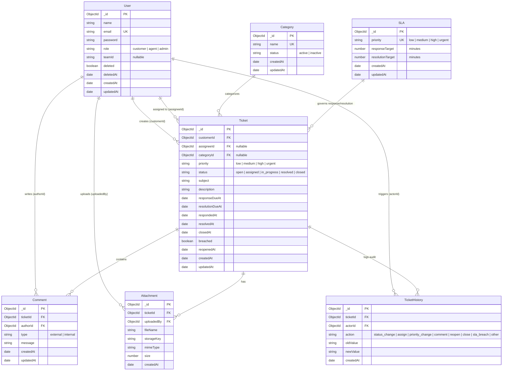

# HelpDesk Ticket Management System — Backend API

Enterprise-grade RESTful API and Real-Time WebSocket server for the HelpDesk Ticket Management System. Built with **Node.js**, **Express 5**, **TypeScript**, **MongoDB (Mongoose 9)**, **Socket.io 4**, and **Zod**.

---

## Table of Contents

- [Architecture & Tech Stack](#architecture--tech-stack)
- [Database Schema & ER Model](#database-schema--er-model)
- [Prerequisites](#prerequisites)
- [Environment Configuration](#environment-configuration)
- [Installation & Local Setup](#installation--local-setup)
- [Database Seeding](#database-seeding)
- [Running the Server](#running-the-server)
- [Running Tests](#running-tests)
- [API Documentation & Swagger UI](#api-documentation--swagger-ui)
- [WebSocket & Real-Time Events](#websocket--real-time-events)
- [Production Deployment](#production-deployment)
- [Directory Structure](#directory-structure)

---

## Architecture & Tech Stack

- **Runtime**: Node.js (v20+ recommended)
- **Framework**: Express 5 with TypeScript
- **Database & ODM**: MongoDB with Mongoose 9
- **Validation**: Zod 4 Schema Validation
- **Authentication**: Stateless JSON Web Tokens (JWT) with bcrypt password hashing
- **Real-Time Communication**: Socket.io (with room-based access controls for live messaging & notifications)
- **File Uploads**: Multer with file type & size restrictions
- **Logging**: Winston logger with structured console and file outputs
- **API Documentation**: OpenAPI 3.0 / Swagger UI
- **Testing**: Jest with `mongodb-memory-server` and Supertest

---

## Database Schema & ER Model



---

## Prerequisites

- [Node.js](https://nodejs.org/) (version 20.x or higher)
- [MongoDB](https://www.mongodb.com/) (version 6.x or 7.x running locally or MongoDB Atlas connection URI)
- [npm](https://www.npmjs.com/) or [yarn](https://yarnpkg.com/)

---

## Environment Configuration

Create a `.env` file in the `backend/` directory based on the template below:

```env
# Server Configuration
PORT=5000
NODE_ENV=development
CLIENT_URL=http://localhost:5173

# Database Connection
MONGODB_URI=mongodb://localhost:27017/helpdesk_db

# Security & Authentication
JWT_SECRET=your_super_secret_jwt_key_at_least_32_characters_long
JWT_EXPIRES_IN=7d
SALT_ROUNDS=12

# File Uploads
UPLOAD_DIR=uploads
MAX_FILE_SIZE_MB=10

# Logging
LOG_LEVEL=info
```

---

## Installation & Local Setup

1. Navigate to the backend directory:
   ```bash
   cd backend
   ```

2. Install project dependencies:
   ```bash
   npm install
   ```

---

## Database Seeding

The seed script initializes the database with SLA policies, categories, realistic demo users with distinct roles, tickets across various states (unassigned, assigned, in progress, breached SLA), comments, yellow internal notes, and audit history.

- **Run Standard Seed** (upserts data):
  ```bash
  npm run seed
  ```

- **Reset and Re-Seed Database** (clears collections and creates fresh seed data):
  ```bash
  npm run seed:reset
  ```

### Default Seed Accounts:
| Role | Email | Password | Description |
| :--- | :--- | :--- | :--- |
| **Admin** | `admin@helpdesk.local` | `Admin@1234` | Full access to users, SLA policies, categories, metrics & reports |
| **Agent** | `agent.alice@helpdesk.local` | `Agent@1234` | Tier 1 support agent, can view assigned/unassigned tickets & internal notes |
| **Agent** | `agent.bob@helpdesk.local` | `Agent@1234` | Tier 2 support agent, handles escalated technical tickets |
| **Customer** | `carol.customer@example.com` | `Customer@1234` | Customer submitting billing and technical requests |
| **Customer** | `dave.customer@example.com` | `Customer@1234` | Customer submitting account and general inquiries |

---

## Running the Server

- **Development Mode** (compiles TypeScript & auto-reloads with Nodemon):
  ```bash
  npm run dev
  ```

- **Build TypeScript to JavaScript**:
  ```bash
  npm run build
  ```

- **Production Mode** (runs compiled `dist/server.js`):
  ```bash
  npm start
  ```

Once started, the API is available at `http://localhost:5000/api/v1`.

---

## Running Tests

The test suite runs against an automated, zero-config in-memory MongoDB database (`mongodb-memory-server`) with Supertest.

- **Run all unit and integration tests**:
  ```bash
  npm run test
  ```

- **Run unit tests only**:
  ```bash
  npm run test:unit
  ```

- **Run integration tests only**:
  ```bash
  npm run test:integration
  ```

---

## API Documentation & Swagger UI

Interactive Swagger documentation is available out of the box when the server is running:

- **Swagger UI**: [http://localhost:5000/api-docs](http://localhost:5000/api-docs)

### API Endpoints Summary (36 Operations):
- **Authentication**: `POST /api/v1/auth/register`, `POST /api/v1/auth/login`, `POST /api/v1/auth/change-password`, `GET /api/v1/auth/me`
- **Tickets**:
  - `POST /api/v1/tickets` (Customer create)
  - `GET /api/v1/tickets` (List with search, status, priority, category, date filters, and agent unassigned/assigned queue scopes)
  - `GET /api/v1/tickets/:id` (Detail with RBAC)
  - `PUT /api/v1/tickets/:id` (Update subject/description/priority)
  - `PUT /api/v1/tickets/:id/status` (Workflow transition: open -> assigned -> in_progress -> resolved -> closed)
  - `PUT /api/v1/tickets/:id/assign` (Agent self-assign/unassign & Admin assignment)
  - `POST /api/v1/tickets/:id/reopen`
  - `POST /api/v1/tickets/bulk/assign`
  - `POST /api/v1/tickets/bulk/status`
- **Timeline & Comments**:
  - `GET /api/v1/tickets/:id/timeline` (Unified chronological feed of comments, internal notes, attachments, and audit events)
  - `POST /api/v1/tickets/:id/comments` (External comment or yellow internal note)
- **Attachments**: `POST /api/v1/tickets/:id/attachments`, `GET /api/v1/attachments/:id/download`
- **Ticket History**: `GET /api/v1/tickets/:id/history`
- **Categories**: `GET /api/v1/categories`, `POST /api/v1/categories`, `PUT /api/v1/categories/:id`, `DELETE /api/v1/categories/:id`
- **SLA Policies**: `GET /api/v1/sla`, `PUT /api/v1/sla/:priority`
- **User Management**: `GET /api/v1/users`, `PUT /api/v1/users/:id`, `DELETE /api/v1/users/:id`, `POST /api/v1/users/:id/reset-password`
- **Reports & Analytics**: `GET /api/v1/reports/tickets`

---

## WebSocket & Real-Time Events

The backend uses **Socket.io** to push instant updates to connected clients:

- **Connection**: `io.connect("http://localhost:5000", { auth: { token: "<jwt_token>" } })`
- **Room Subscriptions**:
  - `join_ticket`: Client joins a specific ticket room (`ticket:<ticketId>`)
  - `leave_ticket`: Client leaves the ticket room
- **Emitted Server Events**:
  - `comment_created`: Emitted when a new external message or internal note is added
  - `ticket_updated`: Emitted when ticket status, priority, or assignee changes
  - `ticket_assigned`: Emitted when a ticket is claimed or reassigned
  - `ticket_created`: Notifies agents of newly submitted tickets

---

## Production Deployment

### Option 1: Process Manager (PM2)
```bash
npm run build
npm install -g pm2
pm2 start dist/server.js --name "helpdesk-backend" -i max
pm2 save
pm2 startup
```

### Option 2: Docker
```dockerfile
FROM node:20-alpine AS builder
WORKDIR /app
COPY package*.json ./
RUN npm ci
COPY . .
RUN npm run build

FROM node:20-alpine AS runner
WORKDIR /app
ENV NODE_ENV=production
COPY package*.json ./
RUN npm ci --only=production
COPY --from=builder /app/dist ./dist
EXPOSE 5000
CMD ["node", "dist/server.js"]
```

### Nginx Reverse Proxy Configuration
```nginx
server {
    listen 80;
    server_name api.helpdesk.yourdomain.com;

    location / {
        proxy_pass http://localhost:5000;
        proxy_http_version 1.1;
        proxy_set_header Upgrade $http_upgrade;
        proxy_set_header Connection "upgrade";
        proxy_set_header Host $host;
        proxy_cache_bypass $http_upgrade;
    }
}
```

---

## Directory Structure

```
backend/
├── src/
│   ├── app.ts                  # Express application setup & middleware
│   ├── server.ts               # HTTP & Socket.io server bootstrap
│   ├── config/                 # Swagger and environment configurations
│   ├── controllers/            # Request handlers (auth, ticket, comment, sla, etc.)
│   ├── middleware/             # Auth JWT, RBAC guards, error handler, multer upload
│   ├── models/                 # Mongoose schemas (User, Ticket, SLA, Category, etc.)
│   ├── repositories/           # Database query layers & regex sanitization
│   ├── routes/                 # Express router declarations
│   ├── seeds/                  # Seed runner & sample data generators
│   ├── services/               # Core business logic, SLA engine, notifications
│   ├── sockets/                # Socket.io room handlers & realtime emitters
│   ├── types/                  # TypeScript interface declarations
│   └── utils/                  # Password hashing, JWT utils, SLA calculators
├── tests/
│   ├── helpers/                # Test database connection and auth token generators
│   ├── integration/            # Multi-role API & RBAC lifecycle tests
│   └── unit/                   # Unit test suites (SLA service, regex repository)
├── package.json
└── tsconfig.json
```
